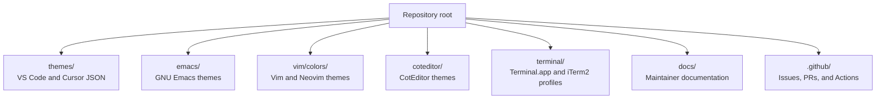
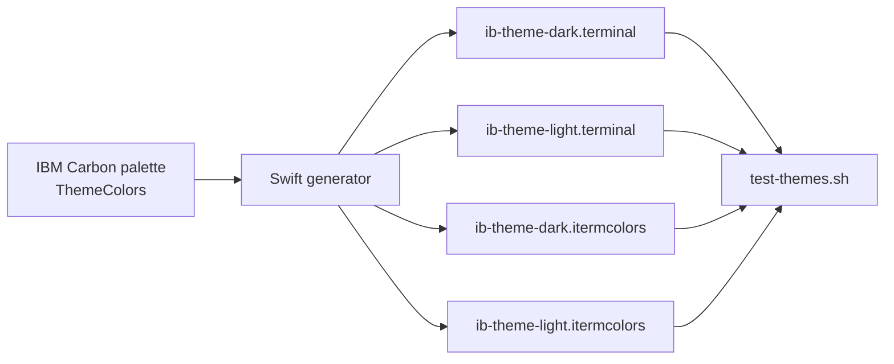
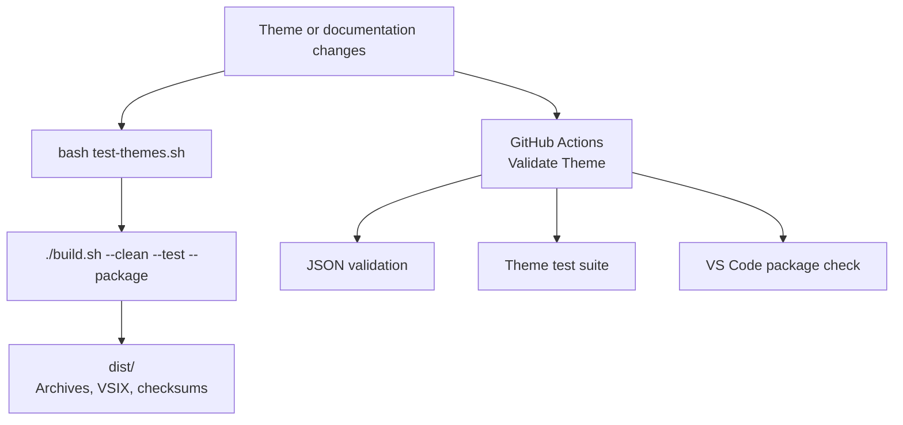
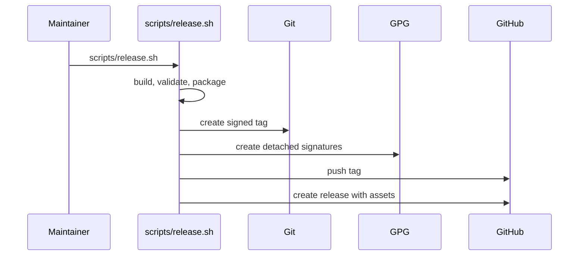
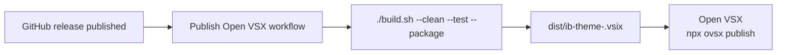

# Architecture

iB-theme ships one visual system across multiple editor and terminal targets. The VS Code/Cursor themes are JSON files, GNU Emacs themes are Emacs Lisp, Vim and Neovim themes are Vimscript, CotEditor themes are `.cottheme` files, and terminal profiles are generated from a shared Swift palette source.

## Repository Map

## Terminal Generation Flow

`terminal/generate-terminal-themes.swift` is the source of truth for terminal profile colors. It writes both Terminal.app and iTerm2 artifacts from the same dark and light `ThemeColors` values.

## Validation And Packaging

Local validation and GitHub Actions use the same test entry point. Packaging copies each supported target into `build/`, creates archives in `dist/`, and writes checksums for release verification.

## Signed Release Flow

Releases use GitHub's free CLI and release tooling. The signed tag and detached artifact signatures use the configured Git signing key when `user.signingkey` is set, otherwise GPG's default secret key is used.

## Open VSX Publishing Flow

Publishing to Open VSX is handled by GitHub Actions after a release is published. VS Code Marketplace publishing remains separate because that release channel is already handled outside this workflow.

